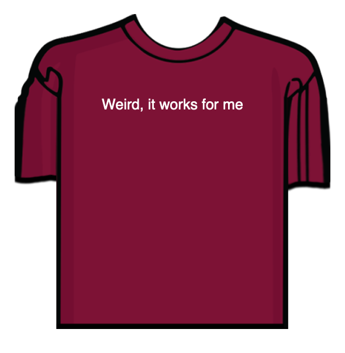

### Python T-shirt text generator

  

 ### Usage 
- (optional) create venv  
- pip install fpdf2

### About
This is T-shirt text generator inspired by CS50P course.
Just type up to 25 characters text to see your personal T-shirt.
Additionally you can specify font-size and output file name.
Program will automatically generate pdf file with your T-shirt.

 